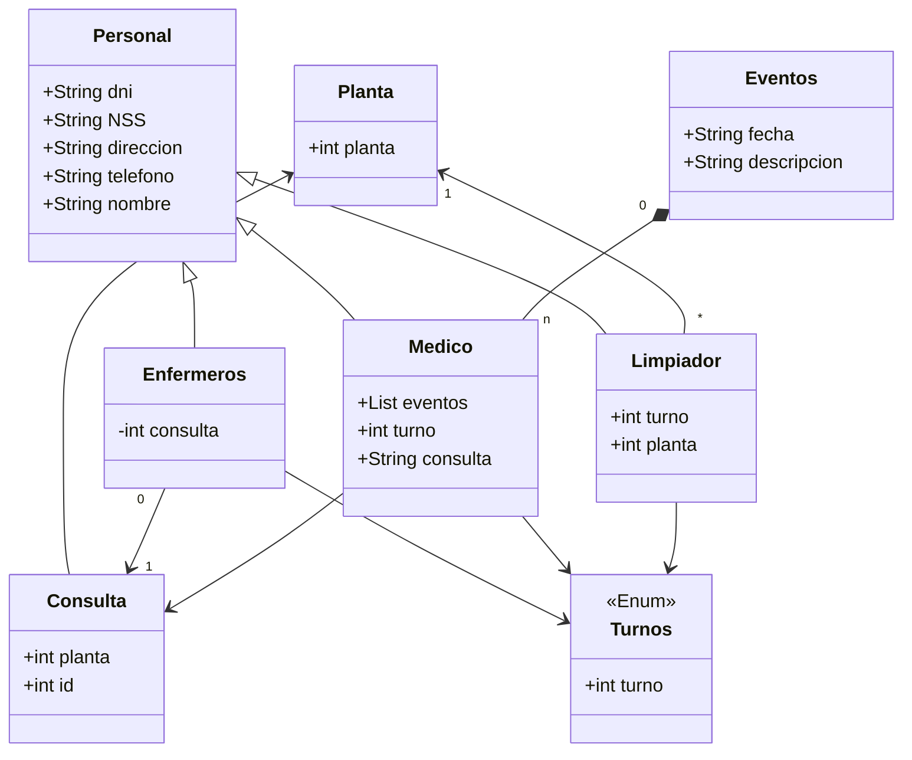

```mermaid
classDiagram
direction TB
    class Personal {
	    +String dni
	    +String NSS
	    +String direccion
	    +String telefono
	    +String nombre
    }

    class Turnos {
	    +int turno
    }

    class Planta {
	    +int planta
    }

    class Consulta {
	    +int  planta
	    +int id
    }

    class Medico {
	    +List eventos
	    +int turno
	    +String consulta
    }

    class Eventos {
	    +String fecha
	    +String descripcion
    }

    class Enfermeros {
	    -int consulta
    }

    class Limpiador {
	    +int turno
	    +int planta
    }

	<<Enum>> Turnos

    Personal <|-- Medico
    Personal <|-- Enfermeros
    Personal <|-- Limpiador
    Planta <-- Consulta
    Planta "1" <-- "*" Limpiador
    Enfermeros "0" --> "1" Consulta
    Medico --> Consulta
    Enfermeros --> Turnos
    Medico --> Turnos
    Limpiador --> Turnos
    Eventos "0" *-- "n" Medico
```